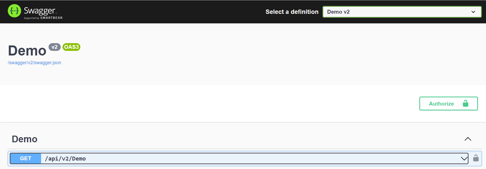

# Quick.SwaggerWidthApiVersion

[](https://github.com/PhilippeTOURNIE/Quick.Swagger)
[](https://conventionalcommits.org)
[](https://github.com/PhilippeTOURNIE/Quick.Swagger/blob/main/LICENSE.md)

Quick start width Swagger  and Api Version in a API Rest Core.


Package                                | Version                                                                                                                                  | Description
---------------------------------------|------------------------------------------------------------------------------------------------------------------------------------------|--------------------------------------------------------------------------
`Quick.Swagger`         | 


## Getting Started

```csharp
// Program.cs
using Quick.SwaggerWidthApiVersion;

var builder = WebApplication.CreateBuilder(args);

// Add services to the container.

builder.Services.AddControllers();

builder.Services.AddQuickSwaggerWidthApiVersion("Demo", 2);

var app = builder.Build();

// Configure the HTTP request pipeline.

app.UseHttpsRedirection();
app.UseAuthorization();
app.MapControllers();

app.AddQuickUseSwagger();

app.Run();

```

Controller width attribute version 

```csharp

    [ApiVersion("1.0", Deprecated = false)]
    [ApiController]
    [Route("/api/v{version:apiVersion}/[controller]")]
    public class DemoController : ControllerBase
    {
     ...
	    [MapToApiVersion("1.0")]
        [HttpGet]
        public IActionResult Get()
        {
            return Ok("Hello World");
        }
	 ...
	}
```

## Step 1 in the builder 
Replace 'AddSwaggerGen' by 'AddQuickSwaggerWidthApiVersion'

Before 
```csharp

builder.Services.AddEndpointsApiExplorer();
builder.Services.AddSwaggerGen(c =>
{

    c.SwaggerDoc(
        "v1",
        new OpenApiInfo
        {
            Title = "Demo",
            Version = "v1"
        });
    c.SwaggerDoc(
        "v2",
        new OpenApiInfo
        {
            Title = "Demo",
            Version = "v2"
        });
    //c.DocumentFilter<VersionnDocsFilter>();
    c.OperationFilter<RemoveVersionParameterFilter>();
    c.DocumentFilter<ReplaceVersionWithExactValueInPathFilter>();
    c.EnableAnnotations();
});
builder.Services.AddApiVersioning(o => 
{
    o.AssumeDefaultVersionWhenUnspecified = true;
    o.DefaultApiVersion = new ApiVersion(1,0);
    o.ReportApiVersions = true;
    o.ApiVersionReader = new HeaderApiVersionReader();
});
builder.Services.AddVersionedApiExplorer(o => {
    o.GroupNameFormat = "'v'VVV";
    o.SubstituteApiVersionInUrl = true;
});
```

Replace by 

```csharp
builder.Services.AddQuickSwaggerWidthApiVersion("Demo", 2);  // 2 -> "v1","v2"
```
Or replace by 

```csharp
builder.Services.AddQuickSwaggerWidthApiVersion("Demo","v1", "v1.1", "v2");
```
Or replace by 

```csharp
builder.Services.AddQuickSwaggerWidthApiVersion("Demo", new List<OpenApiInfo>(){
 new OpenApiInfo
        {
            Title = "Demo",
            Version = "v1"
        });
    c.SwaggerDoc(
        "v2",
        new OpenApiInfo
        {
            Title = "Demo",
            Version = "v2"
        });
});
```


## Step 2 final step in the app 

Replace 'app.UseSwagger' and 'app.UseSwaggerUI' by 'AddQuickUseSwagger'

Before

```csharp
if (app.Environment.IsDevelopment())
{
    app.Logger.LogInformation($"Mode Developpement");
    app.UseSwagger();
    app.UseSwaggerUI(c =>
    {
        c.SwaggerEndpoint("/swagger/v1/swagger.json", "Demo v1");
        c.SwaggerEndpoint("/swagger/v2/swagger.json", "Demo v2");

    });
    app.UseDeveloperExceptionPage();
}
```

Replace

```csharp
app.AddQuickUseSwagger();
```


## Sample

See project ApiDemo




## Build and Development

`dotnet build --configuration release ./Quick.SwaggerWidthApiVersion.csproj`

`dotnet pack -o ./Artefacts ./Quick.SwaggerWidthApiVersion.csproj`

